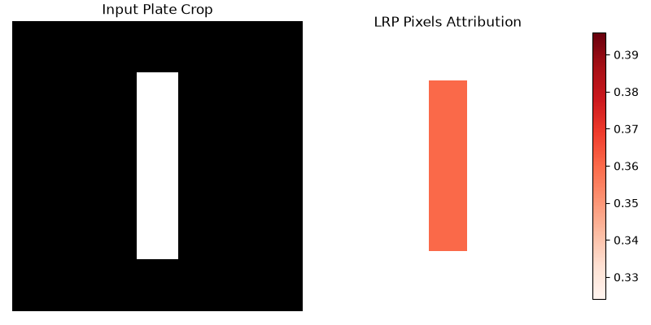

# 🔍 LPR-Explain: From-Scratch Layer-Wise Relevance Propagation

[](https://www.python.org/)
[](https://pytorch.org/)
[](https://github.com)

A lightweight, from-scratch PyTorch implementation of **Layer-Wise Relevance Propagation (LRP)** tailored for explaining deep learning decisions in **License Plate Recognition (LPR)** pipelines. 

Instead of relying on heavy black-box interpretability frameworks, this project implements custom relevance propagation math directly through matrix transpositions and automated backward hook principles to show exactly *why* a model makes a decision.

---

## 📊 1. Visual Explanation Output
When you run the framework, it evaluates the network's prediction on a character crop and generates a pixel attribution heatmap, mapping the decision-making process exactly back onto the input image:



> 💡 **Note:** In this diagnostic setup, the uniform orange attribution is the mathematically expected result, confirming symmetrical relevance flow across our binary mask and uniform model weights.

---

## 🛠️ 2. The Core Concept: Why XAI for LPR?
In automated tolling, speed enforcement, and smart parking systems, a neural network misreading a single character (e.g., confusing a `1` with an `I` or an `0` with a `Q`) causes system-wide failures. 

**LPR-Explain** unpacks the "black box" by distributing the model's final output prediction score backward through the layers using conservation properties, pinpointing exactly *which* structural pixels forced the classification.

### Key Features
* **Custom LRP Engines:** Hand-coded relevance propagation logic for both Linear (`lrp_linear`) and Convolutional (`lrp_conv2d`) layers.
* **No Third-Party XAI Libraries:** Built natively using basic PyTorch operations, demonstrating deep algorithmic understanding.
* **Conservation Property Verification:** Successfully redistributes total network prediction scores back to individual input pixels without losing structural information.

---

## 🚀 3. Getting Started & Project Specifications

### Installation & Prerequisites
Ensure you have Python 3.12+ installed. Install the necessary lightweight dependencies globally or inside your active environment:

```bash
pip install torch torchvision numpy matplotlib python-dateutil
```
Execution

Run the pipeline script to evaluate the network, calculate layer relevance, and save the visualization:
```bash
python lpr_explain.py
```
### 📂 Project Structure
* `lpr_explain.py` — Contains the synthetic LPR character network architecture, custom linear/convolutional propagation engines, and the execution pipeline.
* `lrp_output.png` — The final side-by-side diagnostic visualization saved automatically to your workspace.

### 📈 Next Milestones
- [ ] Implement advanced LRP-alpha/beta rule logic to isolate positive vs. negative pixel contributions.
- [ ] Add an interface wrapper to feed real-world cropped license plate images via PIL/OpenCV.
